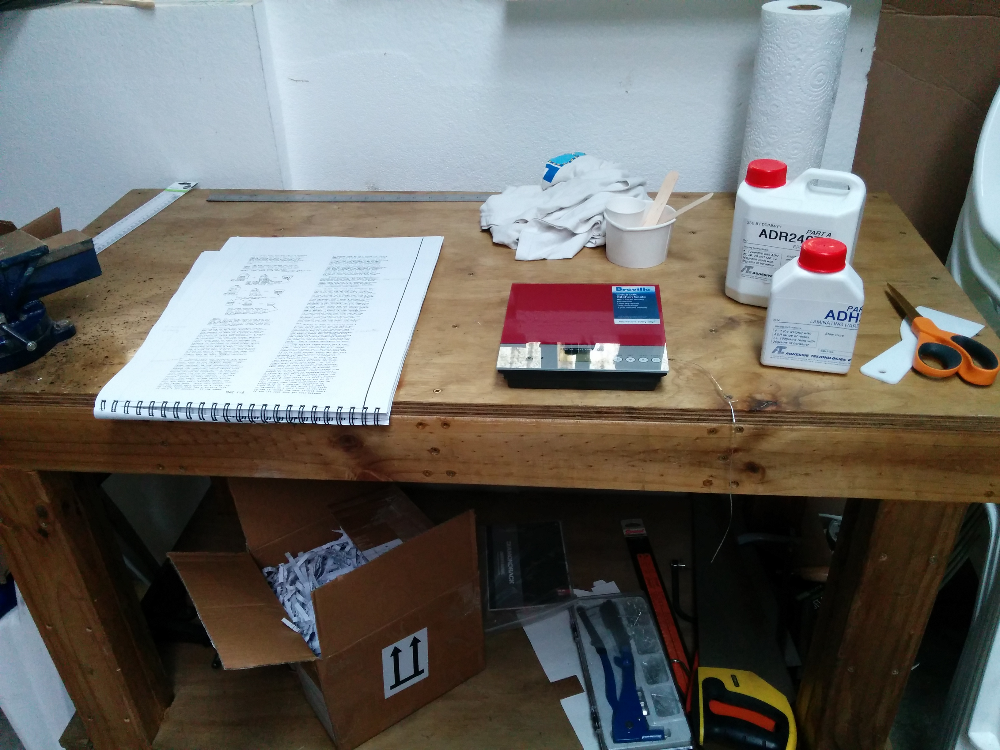
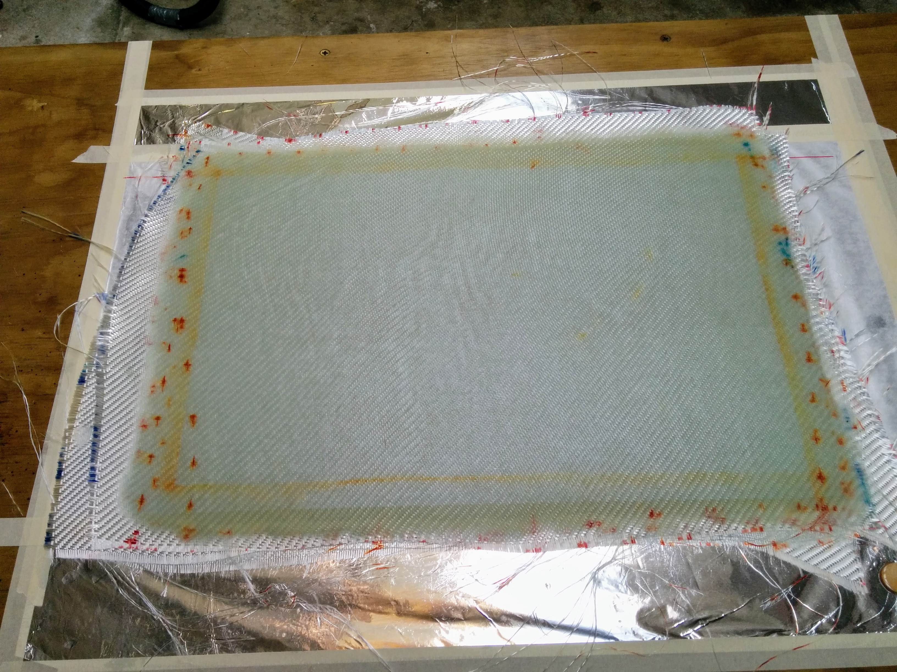
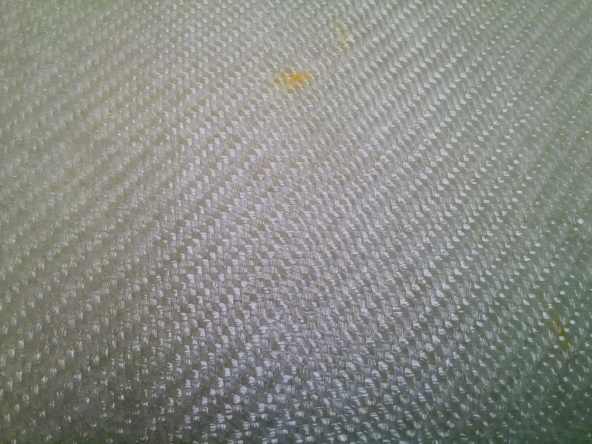

# Composite basics using Adhesive Technologies

I am in New Zealand (South Pacific) and getting the materials around here is a bit of a challenge.

Thanks to Cameron Garner I located a suitable local epoxy resin replacement. __ADR246TG from Adhesive technologies NZ Ltd__.

>NOTE: __THIS IS NOT A PLAN'S APPROVED EPOXY__

__ADR246TG__ requires cures of 24h @ 20°C  followed by a post cure of 12h @ 60°C  to achieve a Heat Distortion Temperature (HDT) of 90°C. It's density is 1.14 g/ml

##  Chapter 3 - Practice Layup
Using __ADR246TG__ and __ADH28__ (Adhesive Technologies NZ Ltd) I made the first layup of 6 BID to weight and examine the quality of my work/resin. 

The ratio of resin hardener is 4 to 1 (weight)

The workshop temperature was 20° C (68° F)

The 6 BID 12.5x18" plies weighted 299 ± 2 gr. I made two batches of composite of 150 ± 2 g each and ended with a bit of excess at the end. In principle the fiberglass/resin ratio used looked a bit too much (too wet?) Ideally the ratio in a finished layup should be 2:1 (fiberglass to resin weight ratio).

The trimmed 10x16" composite rectangle ended in 338 g (11.92 oz) which is 8.3 % heavier than the ideal weight of 312 g (11 oz) but still in the expected range of [298, 354] g ([10.5, 12.5] oz)

The finished width of the 6 BID plies test rectangle is 2.12±0.02 mm or 0.0835±0.0007 in . This corresponds to 0.353 mm per ply or 0.0139±0.001 in.
The expected width of a single BID ply is 0.013 in per ply or 0.078 in for 6 plies. This seems to be another indication that the layup was a bit too wet

__I did a second 6 BID layup__ trying to get it a bit lighter this time (Building up the squeegee muscles). The difference with my first layup is that I spent a bit more time squeegeeing this time and a bit less stabbing it with the brush. ADR wets the cloth really well . the pressure on the squeegee was still very low but I did quite a bit more passes.

This trimmed 10x16" composite rectangle for the second test weighted 317±1 g (11.18 oz) which is 1.02 % heavier than the ideal weight of 312 g (11 oz) but still in the expected range of [298, 354] g ([10.5, 12.5] oz)

The finished width of the second 6 BID test rectangle is 1.86±0.02 mm or 0.0732±0.0007 in . This is 0.31 mm per ply or 0.0122±0.001 in. The expected width of a BID ply is 0.013 in per ply or 0.078 in for 6 plies.

__And a third!__

The tirmmed 10x16" rectangle weights 300±1 g (10.58 oz) which is in the lower marging of the interval or 3.84% lighter thant the ideal average.

__In the the third practice layout I did more squeegeeing that before__ Not a lot of pressure, but many more passes to remove the excess resin. Again, __ADR246TG__ wets the cloth with no efford. Just a little bit of stubbing with the brush and most of the time squeegeeing and queegeeing.

**The three test for the 10x16" 6 BID layup**:

>NOTE: **mean** below is the average from Chapter 3 range 

| Test     |  weight (gr) |  weight (oz) | width (mm) | width (in)   | width ply (mm) | width ply (in) |
|----------|------------  |--------------|------------|--------------|----------------|----------------|
| 1        | 338          | 11.92        | 2.12±0.02  | 0.0835±0.0007| 0.353          | 0.0139±0.001   |
| 2        | 318          | 11.18        | 1.86±0.02  | 0.0732±0.0007| 0.31           | 0.0122±0.001   |
| 3        | 300          | 10.58        | 1.86±0.02  | 0.0732±0.0007| 0.31           | 0.0122±0.001   |
| **mean** | **312**      | **11.0**     | **1.98**   | **0.078**    | **0.33**       | **0.013**      |

## Units of things

Not that any pilot would be scared with mixing units :-) Here in New Zealand aircraft goes with speed in Knots, altitudes in feet, Atmospheric pressure in hPa (Hecto Pascals), distance in nm and the length of the runways in meters.

| magnitude   |  metric    |  imperial |
|-------------|------------|-----------|
| length      | 0.3048 m   | 1 foot    |
| length      | 0.0254 m   | 1 inch    |
| mass        | 28.3495 gr | 1 oz      |
| mass        | 453.592 gr | 1 lb      |
| Volume      | 3.78541 l  | 1 US gal  |
| Volume      | 4.54609 l  | 1 Imp gal |
